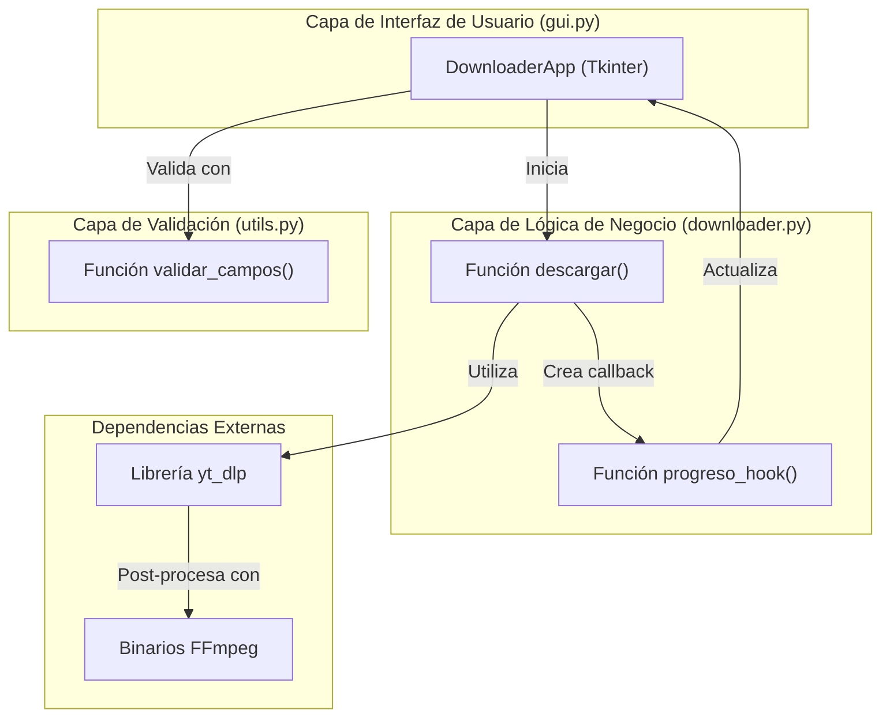

---

# GUI YouTube Downloader 

**GUI YouTube Downloader** es una aplicación de escritorio para Windows, macOS y Linux que permite descargar contenido multimedia desde URLs en múltiples formatos. Construida con Python y Tkinter, esta herramienta ofrece una interfaz gráfica intuitiva para gestionar descargas de videos y audio, aprovechando el poder de la librería yt-dlp.


---

## Índice

- [Características Principales](#características-principales)
- [Arquitectura del Sistema](#arquitectura-del-sistema)
- [Stack Tecnológico](#stack-tecnológico)
- [Guía de Inicio Rápido](#guía-de-inicio-rápido)
  - [Prerrequisitos](#prerrequisitos)
  - [Instalación](#instalación)
- [Cómo Usar](#cómo-usar)
- [Contribuciones](#contribuciones)
- [Licencia](#licencia)

---

## Características Principales

- **Múltiples Formatos:** Descarga videos en **MP4** y **WEBM**, o extrae solo el audio en formato **MP3**.
- **Soporte para Playlists:** Alterna fácilmente entre descargar un solo video o una lista de reproducción completa.
- **Incrustación de Metadatos:** Añade automáticamente metadatos (título, artista) y miniaturas a tus archivos descargados.
- **Autocompletado de Título:** El nombre del archivo se rellena automáticamente con el título del video al pegar la URL.
- **Seguimiento en Tiempo Real:** Monitorea el progreso de la descarga con una barra de progreso, velocidad y tamaño total.
- **Interfaz Responsiva:** La interfaz gráfica se mantiene siempre activa y sin bloqueos gracias a una arquitectura multihilo.
- **Validación de Entradas:** Comprueba que la URL y la carpeta de destino sean válidas antes de iniciar la descarga.

---

## Arquitectura del Sistema

La aplicación sigue una arquitectura de tres capas que separa la interfaz de usuario, la lógica de negocio y las utilidades de validación. Para mantener la interfaz gráfica responsiva, las operaciones de red (obtención de metadatos y descargas) se ejecutan en hilos de fondo.



La comunicación entre los hilos de fondo y la interfaz principal se realiza de forma segura a través del método `root.after()`, garantizando que todas las actualizaciones de la GUI ocurran en el hilo principal.

---

## Stack Tecnológico

| Componente | Tecnología / Versión | Propósito |
| :--- | :--- | :--- |
| **Lenguaje** | Python 3.7+ | Lenguaje de programación principal |
| **Framework GUI** | Tkinter / Ttk | Interfaz gráfica de usuario (incluido en Python) |
| **Motor de Descarga** | `yt-dlp` | Librería para la extracción y descarga de medios |
| **Post-procesamiento** | FFmpeg | Conversión de formatos y manejo de metadatos |
| **Concurrencia** | `threading` | Módulo para la ejecución de tareas en segundo plano |

---

## Guía de Inicio Rápido

Sigue estos pasos para tener la aplicación funcionando en tu sistema.

### Prerrequisitos

1.  **Python 3.7 o superior:** Asegúrate de tener Python instalado y añadido a tu `PATH`.
2.  **FFmpeg:** `yt-dlp` requiere FFmpeg para procesar los archivos de audio y video.
    -   **Windows:** Descárgalo desde [ffmpeg.org](https://ffmpeg.org/download.html) y añade la carpeta `bin` a tu `PATH`.
    -   **macOS:** `brew install ffmpeg`
    -   **Linux (Debian/Ubuntu):** `sudo apt update && sudo apt install ffmpeg`

    Verifica la instalación ejecutando `ffmpeg -version` en tu terminal.

### Instalación

1.  **Clona el repositorio:**
    ```bash
    git clone https://github.com/OAQR/GUI-YouTube-Downloader.git
    cd GUI-YouTube-Downloader
    ```
    *(Reemplaza la URL si es diferente)*

2.  **Crea un entorno virtual (recomendado):**
    ```bash
    python -m venv venv
    ```
    -   **Actívalo en Windows:** `venv\Scripts\activate`
    -   **Actívalo en macOS/Linux:** `source venv/bin/activate`

3.  **Instala las dependencias de Python:**
    ```bash
    pip install yt-dlp
    ```
    *(Nota: En algunas distribuciones de Linux, puede que necesites instalar `tkinter` por separado: `sudo apt-get install python3-tk`)*

---

## Cómo Usar

Una vez completada la instalación, ejecuta el siguiente comando desde la raíz del proyecto:

```bash
python gui.py
```
Esto lanzará la aplicación. Sigue estos pasos para descargar:

1.  **Pega una URL** en el campo correspondiente.
2.  **Elige una carpeta de destino** haciendo clic en "Elegir...".
3.  (Opcional) Modifica el **nombre del archivo** (se autocompleta al pegar la URL).
4.  Selecciona si es un **video único o una lista**.
5.  Elige los **formatos** que deseas descargar (MP4, WEBM, MP3).
6.  Haz clic en **"Descargar"**.

---

## Contribuciones

Este es un proyecto de portafolio personal y actualmente no se aceptan contribuciones externas. Sin embargo, si encuentras algún error o tienes alguna sugerencia, no dudes en abrir un *Issue* en el repositorio.


---

## Licencia

Este proyecto está distribuido bajo la Licencia MIT. Consulta el archivo `LICENSE` para más detalles.
